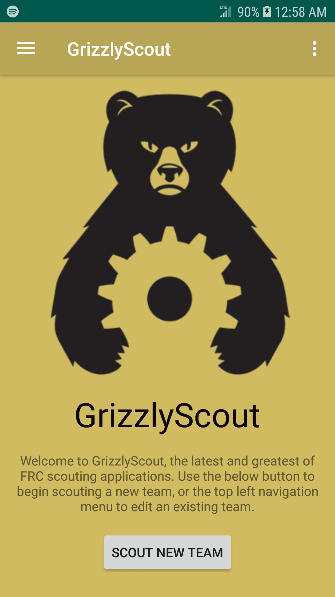

# GrizzlyScout

GrizzlyScout is an FRC scouting application designed to alleviate many of the common issues with scouting that Grizzly Robotics has identified.

## Features

- Automatic data analysis
- Targets Android 5.1
- Wired data transmission, no need to rely on unreliable wireless communication
- Easy in-app editing of data

## Note

This application is meant to be paired with the [GrizzlyScout Desktop application](https://github.com/YCSRobotics/GrizzlyScout-Server). However, GrizzlyScout JSON data can be manually exported and interpreted using a custom reader. This is an advanced configuration and not recommended.

## License

GrizzlyScout is licensed under MIT. Please see the license.
